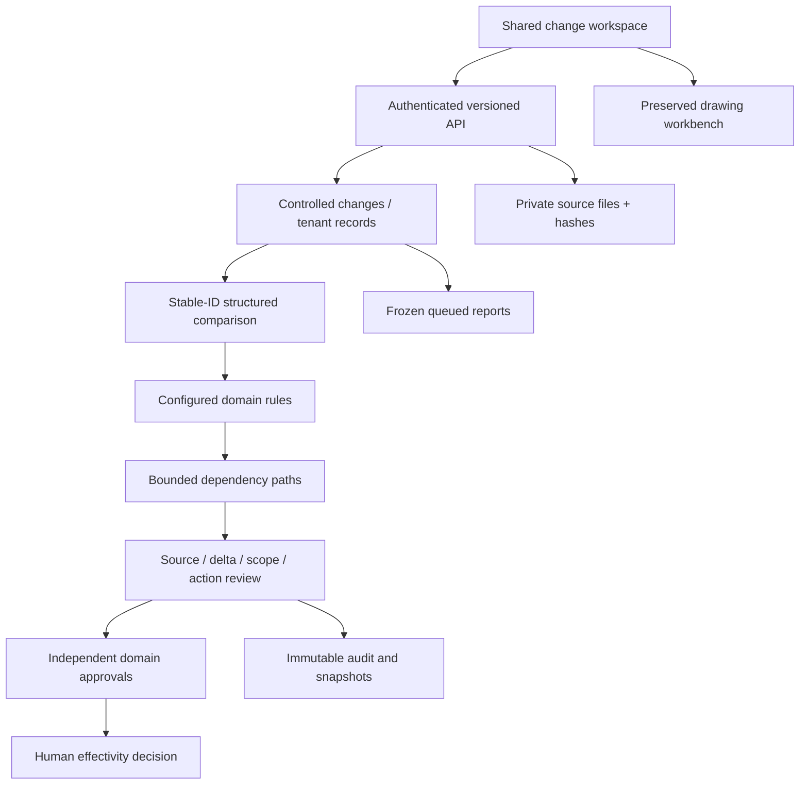

# Architecture — engineering foundation and universal change core

## Before and after

The original implementation had one extraction/comparison/risk module, synchronous reports, array-based balloon numbers and JSON-only graph edges. The revision retains the working FastAPI/React/PostgreSQL workflow while separating drawing parsing, comparison, evidence, rules, graph persistence and the verification interface. See AUDIT.md for the inspected baseline and FINAL_REVIEW.md for the disposition.

```mermaid
flowchart LR
 UI[React engineering workspace] --> API[FastAPI v1 · tenant + role boundary]
 API --> DB[(PostgreSQL · versioned aggregates)]
 API --> Files[Private source volume · SHA-256]
 DB --> Jobs[Durable extraction / report jobs]
 Jobs --> Parser[Bounded local subprocess]
 Parser --> Vector[PDF vector text + page layout]
 Parser --> OCR[Optional local Tesseract]
 Vector --> Grammar[Engineering grammar + reconciliation]
 OCR --> Grammar
 Grammar --> Evidence[Source-located characteristics + immutable extraction snapshot]
 Evidence --> Compare[Structured comparison + Decimal interval arithmetic]
 Compare --> Graph[Directed typed dependency graph]
 Graph --> Rules[Versioned rule recommendations + score contributors]
 Rules --> Human[Source verification · document review · actions]
 Human --> Approvals[Engineering → different quality reviewer → manager]
 Approvals --> Seal[Immutable release snapshot + evidence digest]
 Seal --> Reports[PDF / Excel / JSON evidence reports]
```

## Component boundaries

- `src/main.tsx`: workspace shell, accounts, projects, existing review workflows and audit.
- `src/engineering.tsx`: source workbench, split-pane comparison, rule evidence, merge/split forms, workbook onboarding and asynchronous report dialog.
- `backend/main.py`: authenticated, tenant-scoped application services and API. PostgreSQL advisory transaction locks serialize tenant mutations; SQLAlchemy version columns reject stale aggregate updates in both databases.
- `backend/boundary.py`: bounds actual body bytes before multipart parsing, including chunked transfers. It buffers up to 21 MB; size limits do not replace concurrency/resource limits.
- `backend/intelligence.py`: validation, canonical spreadsheet import and provider compatibility; `drawing.py`: staged PDF/DOCX/image processing; `ocr.py`: local OCR adapter; `extract_task.py`: 120-second extraction subprocess.
- `backend/comparison.py`: semantic matching, changed requirements and deterministic interval metrics. Movement/format-only/unchanged results are available separately from engineering changes.
- `backend/evidence.py`: original extraction, correction history, stable annotations, canonical hashing and snapshots.
- `backend/rules.py` + `rules/core.json`: auditable rule conditions, score contributions and reviews. Industry packs configure thresholds; the two-reviewer minimum remains fixed.
- `backend/graph.py`: typed edge persistence plus compatible project graph read model. `AdjacencyGraph` implements cycle-safe traversal behind a replaceable graph contract.
- `backend/reports.py`: evidence workbooks, readable PDF sections, source excerpts and balloon exports.

## Jobs and concurrency

Uploads retain private bytes and enqueue database jobs. Workers use PostgreSQL SKIP LOCKED claims, mark RUNNING, verify the hash, and invoke a bounded extraction subprocess. Outputs receive immutable extraction snapshots. Late workers encounter optimistic version conflicts rather than overwriting a retried job/review. Failed extraction and abandoned RUNNING jobs older than ten minutes can be explicitly retried, except released or already-reviewed source evidence.

Reports requested from the interface snapshot their payload and audit history when queued. A report worker writes a private artifact with a hash; downloads require the same tenant's authenticated session. Job status responses exclude report payloads and storage keys. Report generation itself does not yet have a hard subprocess timeout. Legacy synchronous report endpoints remain for API compatibility.

## Release invariants

Every active characteristic must be verified; both source completeness declarations, dependency completeness, all detection dispositions, all document reviews and all actions must be resolved. Rejected/superseded extractions remain in evidence history and do not participate in comparison. Changes invalidate prior approvals. Engineering and independent quality decisions seal the same evidence digest. Release checks the digest and creates a database-immutable snapshot including source characteristics, project graph, changes, inventory, documents, actions and approvals. Released source edits and change-set mutations are rejected. No stock-blocking or scrapping operation exists.

SQLite remains a local evaluation fallback. PostgreSQL is the deployment target. Typed JSON aggregates still carry most entities; graph rows add explicit relationships rather than pretending every future entity has its own physical table. No Neo4j, hosted LLM or live ERP dependency is required. PostgreSQL/Docker deployment and real concurrent-load behavior remain unverified on this machine.
# Revision 3: shared change core

The default React workspace (`src/universal.tsx`) uses a versioned FastAPI router (`backend/universal.py`), the deterministic shared engine (`backend/change_engine.py`) and configured domain packs. A dedicated indexed `ControlledChange` aggregate and explicit dependency edges sit alongside existing engineering records. Audit events and immutable evidence snapshots are shared infrastructure.

Universal input adapters currently accept CSV/XLSX/JSON. Drawing extraction stays in the specialized workbench. Shared graph/rule interfaces allow future adapters without model-provider dependence. Domain logic is separated from existing industry overlays. See MULTI_DOMAIN_REVIEW.md for before/after decisions and KNOWN_LIMITATIONS.md for unfinished integration boundaries.
