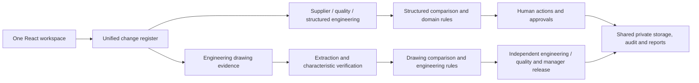

# ChangeGuard AI — shared workspace integration review

Date: 7 September 2026. Scope: integrate the established drawing workflow into the three-pack Change & Impact Intelligence MVP for MCCIA AI Applied Studio.

## Current-system audit and gaps

The application already had FastAPI, authenticated tenant-scoped PostgreSQL aggregates, private document storage, deterministic drawing extraction, structured multi-domain comparison, configurable rules, graph traversal, actions, independent approvals, and queued reports. The frontend selected two different application shells using `#engineering`. Drawing changes were absent from the multi-domain dashboard, action queue and report register. Universal engineering records had no path to their own drawing revisions.

| Priority | Finding | Disposition |
|---|---|---|
| P0 | Drawing and structured workflows could become parallel approval records | Explicit drawing authority; duplicate comparisons and alternate approval/report mutations blocked |
| P0 | PDF dependency warning polluted worker stdout and broke JSON decoding | Isolated diagnostic output from JSON; real PDF subprocess regression added |
| P1 | Two navigation shells and separate change/action registers | One application shell and unified, tenant-scoped workspace read model |
| P1 | No engineering record-to-drawing route | Audited, idempotent setup links a controlled change to its drawing project and comparison |
| P1 | Prior structured evidence could be lost during integration | Original aggregate retained; immutable snapshot and original-history disclosure |
| P1 | Deep links and browser back behavior inconsistent | Shared hash routes for pages, change records and drawing tabs; old `#engineering` opens Drawings within the shared shell |
| P2 | Generic document adapters, additional domain packs, enterprise asset catalog | Explicitly remain outside this three-pack MVP |

## Architecture before and after

Before: login → either universal application shell or engineering application shell → separate registers and review screens.

After: login → one workspace shell → one change register → structured or drawing evidence view → the corresponding authoritative rule/review/release engine. Actions, approvals and report navigation include both kinds of record.

The existing engineering algorithms and release gates are preserved, rather than flattening technical characteristics into generic text cells. There is no second frontend, iframe, login, or database.

## Model and API changes

`backend/workspace.py` introduces `/api/v1/workspace/changes`, its detail endpoint, and an explicit drawing-setup mutation. The public workspace row includes `workflow`, normalized actions/status, and drawing references. An unlinked historical engineering comparison is included directly. A linked comparison appears once under its original controlled-change ID.

Drawing setup stores `drawing_project_id` on the controlled aggregate, `controlled_change_id` and effectivity on the project, and the parent reference on the comparison. These are validated references in existing versioned JSON aggregates; no new database table or migration is required. Cloud document bytes continue using migration 0004. A fully normalized relational cross-workflow schema remains future work.

Only internal engineering changes may open a drawing workspace. Existing approved, terminal, or completed-action decisions cannot switch authority. Previous structured evidence is retained, not interpreted as verified drawing extraction. Setup never automatically compares, verifies, approves or releases anything.

## Packs and rule architecture

Working packs remain Engineering, Supplier/Procurement and Quality. Engineering handles drawing or structured specifications; supplier rules cover lead time, source/material and commercial changes; quality rules cover inspection intervals/methods. Configured scalar-field domain rules remain in `domain_packs/*.json`; specialized drawing rules remain in `rules/core.json` and industry overlays. No new unsupported pack is advertised as operational.

Scores are deterministic review priorities, not probabilities or predicted losses. The drawing register displays the highest characteristic score rather than adding scores across different characteristics. UNKNOWN dependency and inventory information remains visible. No machine capability is invented.

## AI pipeline and graph

The core remains AI-off. Structured inputs use stable IDs and normalized field comparison. Drawings use supported vector text/layout, optional local OCR, deterministic engineering parsing and validation, then human completeness/characteristic verification. Provider contracts remain extensible; no external model is called by this integration.

Graphs retain explicit, bounded directed relationships. Domain graphs show actual source-to-impact paths; engineering maps retain typed manufacturing dependencies and rules. Company-wide asset reconciliation and automatic propagation across change records are not implemented.

## Security and release behavior

Workspace reads require the existing session and tenant boundary. Commercial records retain domain access filtering; commercial-to-drawing conversion is rejected. Setup requires engineering/manager/admin authority and a current version. PostgreSQL tenant mutation locks and project row locks protect comparison creation. The shared read model does not expose private storage keys.

The same controlled change cannot be approved through both routers. Linked generic writes and generic report generation return 409 and direct the user to current drawing evidence. Engineering, independent quality, and explicit manager release remain enforced. Future effective dates block drawing release. Batch/order/WIP effectivity requires the manager's recorded evidence; there is no live ERP check.

## Tests and results

- Final full regression suite: **112 passed in 124.66 seconds**, including real-PDF worker output, independent approval and future-effective-date release blocking.
- Production frontend build: TypeScript and Vite passed.
- Browser: created a local internal engineering change, uploaded both fictional GS-204 PDFs, extracted both versions, opened characteristic verification and compared the 5× tighter bearing-seat tolerance in the shared shell.
- API integration: legacy and structured records in one register; linked changes shown once; role/tenant/commercial boundaries; stale-version rejection; original evidence retained; duplicate/alternate approval blocked; independent two-person approval and release; queued report includes the original integration audit event.

Tests use isolated SQLite fixtures. Live Supabase/Render connectivity was already verified in the preceding deployment fix; it is not a substitute for PostgreSQL concurrent-load testing.

## Performance

Measured in-memory graph indexing plus bounded traversal on this Windows host: 100 nodes/1,000 edges, 1.5 ms; 1,000/10,000, 3.7 ms; 10,000/100,000, 31.2 ms. These graphs intentionally reached the depth bound and reported truncation. This is not full-graph analysis or an API/database scalability claim. The unified register currently constructs a tenant read model before response pagination and is suitable for pilot volumes; move filtering/pagination into SQL before large deployments.

## Demo scenarios

1. New change → Engineering → Drawing revisions → enter GS-204 → upload `samples/GS-204-Rev-C.pdf` and Rev D → inspect Evidence → compare → inspect Diff, Impact, Documents, Actions, Approvals and History. No approval is generated by the demonstration.
2. Existing Supplier demonstration: lead time 7 → 14 days; review mapped products/orders and purchase/PPC actions.
3. Existing Quality demonstration: inspection interval 100 → 20 units; inspect calculated workload implications and required review actions.

All PRAGATI data and sample drawings are fictional. Local browser testing uses a separate demonstration database on port 8012 and does not add test approvals to the live workspace.

## Known limitations

See KNOWN_LIMITATIONS.md. This remains a controlled pilot, not a certified production release system. Only three domain packs work. No generic PDF policy semantic interpretation, native CAD/GD&T completeness, HR/compliance legal decisions, ERP synchronization, SSO/MFA, malware scan, KMS orchestration, or automatic notifications are claimed. Structured and drawing evidence retain specialized schemas and different terminal status names; the workspace unifies navigation and authority, not all storage internals. Free Render cold starts and Supabase/document quotas remain applicable.

## Next ten improvements

1. PostgreSQL integration CI, contention tests and tenant restore drills.
2. SQL-native shared register filtering, pagination and incremental status projection.
3. Versioned organizational master data and explicit cross-change dependencies.
4. Dedicated object storage, reviewed retention, malware scanning and resource isolation.
5. SSO/MFA, account recovery and lifecycle administration.
6. A representative, independently reviewed engineering extraction evaluation set.
7. Richer document adapters with page/section provenance and bounded evaluation.
8. Evidence-preserving successor changes and multi-revision evolution views.
9. Reviewed production/compliance packs with domain expert fixtures and gates.
10. Durable event dispatch and an explicit, approved PromiseFlow handoff contract.
